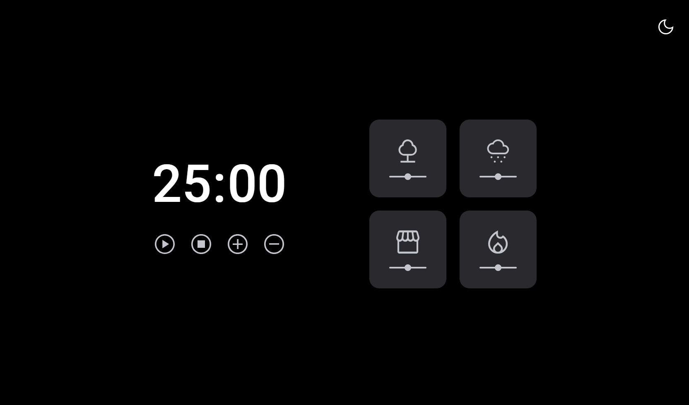
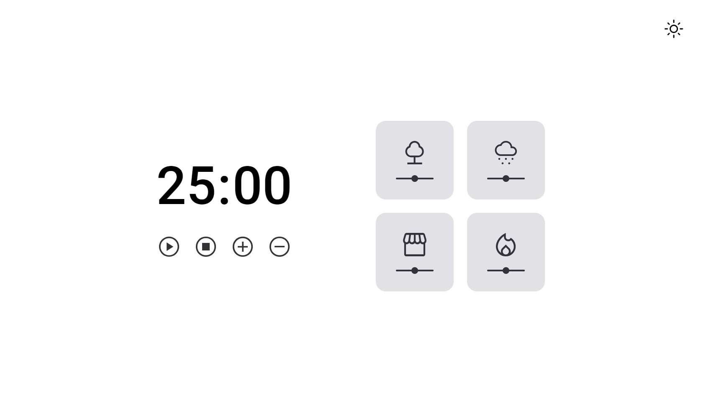

<strong><h1 align="center">Desafio Focus Timer</h1></strong>

Este projeto foi desenvolvido como desafio do Stage 05: Avançando com JavaScript, do curso Explorer da Rocketseat. O desafio foi dividido em duas partes, 
a primeira sendo a criação do timer, controles e cards de som; e a segunda sendo a criação de tema dark mode, e controle de volume dos sons de cada card.

## 🎨 Layout

O layout do projeto está disponível no [Figma](https://www.figma.com/design/LPz4j6xdSJTwVhRze6qdyG/Stage-05---Focus-Timer-2.0-(Copy)?node-id=0-4&node-type=frame&t=5fHVY0YT2jOQEbRD-0)

  
  

## 🚀 Tecnologias

Esse projeto foi desenvolvido com as seguintes tecnologias:

- HTML e CSS
- JavaScript
- Git e Github
- Figma

## 🚀 Pré-requisitos

Antes de começar, você vai precisar ter instalado em sua máquina as seguinte ferramenta:

Feito com ♥ by [Gelzieny](https://gelzieny.dev)
